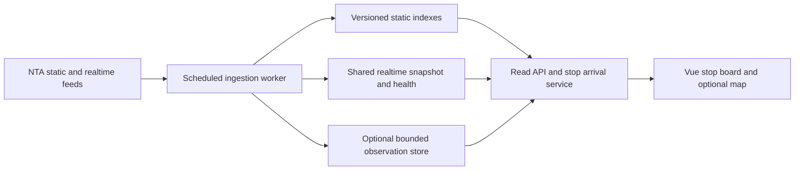

# BusTime 1.0: feasibility report and release plan

Assessment date: 15 September 2026. Baseline: commit `853b1fe`.

## 1. Executive decision

**Conditional go for a focused public bus-arrival product. The current build is a working pre-release, but is not yet supported by enough production and data-quality evidence for 1.0.** Keep the Vue application and transit domain code. Prioritize reliable arrival information, production-safe data ingestion, and clear degraded states before extending the product.

The repository is named `incidents-map`, the package is `bustime` at `0.0.0`, and the active product is BusTime / “Where is my bus?”. This report assumes the current bus product is the intended 1.0. Environmental incidents, telemetry and replay are retained legacy code, outside the mounted runtime. Reintroducing them would be a separate product decision and require re-estimation.

Recommended promise: **Find your stop, understand the next available bus information, and see how current and reliable that information is.** Begin with a Dublin validation cohort; qualify each additional city/operator before advertising coverage. An “All Ireland” map extent does not establish nationwide feed coverage, especially Northern Ireland.

Planning envelope: **53–83 engineering days, plus 25% contingency: approximately 67–104 days**, or roughly **14–21 working weeks for one full-time engineer**. A two-week beta observation window is also required and can overlap final work. These are estimates, not a delivery commitment; data access, full GTFS processing and feed semantics are the main uncertainties.

## 2. Scope and evidence

Reviewed the active Vue UI, transit composable, map integration, ETA/delay logic, GTFS adapters and indexes, server middleware, history store, Vercel configuration, README, package scripts and tests. No application features were changed for this assessment.

### Verification performed

| Check | Result | Meaning and limits |
| --- | --- | --- |
| `npm run test:eta` | 11/11 pass | Predictor fixtures cover stale positions, loops, outliers and target stops; not field accuracy |
| `npm run test:history` | 2/2 pass | Local persistence and derived transitions; not distributed storage |
| `npm run test:transit` | 9/9 pass | Query, scope and delay evidence cases; not complete GTFS semantics |
| `npm run build` | Pass | API bundle, Vue/TypeScript and frontend build succeed |
| `npm run smoke` | Pass | Chromium desktop/mobile flows and map rendering with controlled transit responses |

The observed build produced a 118.02 kB application JS chunk (43.48 kB gzip), 54.28 kB CSS (8.93 kB gzip), and a dynamically loaded Mapbox chunk of 1,827.10 kB (503.12 kB gzip). Vite warned about chunk size. These are build measurements, not network or interaction performance measurements. The renderer is already lazy loaded; evaluate map-free first use before adding more chunk splitting.

Not verified: deployed production behavior, live NTA credentials or availability, operator coverage, real ETA accuracy, cold-start memory/duration, load capacity, accessibility conformance, Safari/Firefox behavior, dependency vulnerabilities, actual invoices or licensing entitlement. The smoke test does not establish any of these. No repository CI workflow was found under `.github`.

## 3. Current product inventory

| Capability | Current implementation | 1.0 assessment |
| --- | --- | --- |
| Stop and route search | Debounced, bounded server search; city scoping | Retain; improve direction and stop identification |
| Live bus map | Route/area filtering, stop selection, shapes/trails | Retain; measure busy-area performance |
| Nearby stops | Geolocation, approximate 1 km search, distance sorting | Retain; permission and dense-area correctness work |
| Stop arrivals | Matching live trips, progressive predictions, up to 24 rows | Incomplete departure-board coverage |
| ETA and delay evidence | Provider/schedule/movement inputs, confidence and staleness handling | Useful foundation; validate and correct semantics |
| Alerts | Selected route/trip/stop matching | Broader alert scope and cancellation handling required |
| Mobile and theme | Responsive panels, map/detail controls, persisted light/dark theme | Existing smoke passes; usability/accessibility audit needed |
| Map fallback | Mapbox with token; MapLibre/OSM without token | Verify both deployment builds and usage terms |
| History | Local JSONL observations, transitions, prediction endpoints | Prototype persistence; unsuitable as production record without changes |
| Favorites, shared stop URLs | Not found in active runtime | Small, high-value 1.0 additions |
| Accounts, push alerts, journey planning | Not implemented in active runtime | Defer |

## 4. Feasibility by dimension

### Product and market: plausible, demand unproven

TFI already provides real-time departure and journey-planning information through its official app. BusTime therefore needs a narrower advantage: quick browser access, legible stop boards, reusable links and honest freshness explanations. This is a product hypothesis, not evidence of unmet demand or commercial viability. [TFI Live](https://www.transportforireland.ie/available-apps/tfi-live/)

Recruit 8–12 commuters, including occasional users and people using assistive technology. Ask them to find a stop, identify the correct direction, interpret an unavailable arrival, and return to a saved stop. Target at least 80% unaided completion and no recurring confusion between scheduled and live times. Use a 20–50 person beta to investigate repeat use; do not infer a viable paid business from usability results alone. A paid subscription or advertising model needs separate willingness-to-pay and audience evidence.

### Technical: feasible with targeted backend changes

Vue, TypeScript, existing provider boundaries and lazy renderer loading are adequate foundations. A framework rewrite would not address the main risks. The largest changes belong in ingestion, stop-level arrival composition, time semantics and deployment architecture.

### Data: critical dependency

The application can only be as complete as its feeds and joins. Record fresh vehicle counts, trip-to-static match rates, TripUpdate availability, alert coverage and unexplained empty boards by operator and city. Separate provider failure from legitimate absence of data. Confirm the exact production endpoints, account quotas, attribution and redistribution conditions with the production subscription; a discoverable UAT policy is not proof of production entitlement. [NTA GTFS portal](https://developer.ntaapptest.transportforireland.ie/GTFS)

### Operations: currently the weakest area

The Vercel adapter is present, but filesystem assumptions need correction and deployment validation. Vercel documents a read-only filesystem with writable temporary scratch space. Code writing below `process.cwd()` therefore needs a different storage strategy; temporary storage also cannot serve as durable shared history. [Vercel runtimes](https://vercel.com/docs/functions/runtimes)

### Financial: affordable pilot is plausible; operating cost is unmeasured

Budget by measured sessions, concurrent polling, tile usage, feed ingestion and retained observations. The cost model below is a planning allowance, not a provider quotation. Avoid committing to a commercial launch until hosting and data terms are confirmed.

## 5. Principal findings and release blockers

P0 means mandatory before public 1.0. P1 means planned release value that can be deferred explicitly if the reliability work expands.

| ID | Priority | Evidence and impact | Required result |
| --- | --- | --- | --- |
| R1 | P0 | `staticGtfs.ts` writes `.atlasops-cache`; `historyStore.ts` writes `.atlasops-data`, both beneath the working directory by default | Read-only-host staging passes; static data is preprocessed outside requests; history is durable or explicitly disabled |
| R2 | P0 | `useTransit.refreshDetails()` builds arrivals only from visible matching vehicles | A stop board composes scheduled services and all relevant stop TripUpdates independently of GPS presence; missing GPS must not erase valid departures |
| R3 | P0 | `fetchTripUpdateEndpoint()` selects one stop update; model omits cancellation/skipped-stop semantics | Preserve ordered updates and relevant trip/stop relationships, match the selected stop, suppress cancelled/skipped service correctly |
| R4 | P0 | Server `serviceDaySeconds()` uses host-local hours; predictor `serviceDayIso()` uses browser-local midnight; static trip model lacks service calendar/timezone metadata | Explicit agency timezone and service date, calendars/exceptions, after-midnight and DST tests in multiple host/browser timezones |
| R5 | P0 | `cached()` returns an old value after loader failure without returning failure metadata or bounding stale age | Responses include last success, feed timestamp, stale/degraded status and bounded expiry; outages remain visible |
| R6 | P0 | Upstream fetches have no explicit application deadline; endpoint fallback/retry can compound; detail requests allow 120 seconds | Bounded timeouts, retry budget, pinned validated endpoints and prompt recoverable UI; cancelled selections cannot overwrite current state |
| R7 | P0 | Public prediction POST has weak validation and no route-level authentication/rate limiting; diagnostics are publicly routed | Disable unused write/diagnostic routes or protect them; enforce methods, schemas, limits and sanitized errors |
| R8 | P0 | Local append queue remains rejected after a failed write; reads load whole JSONL files; deduplication is process-local | Remove from request path; recovery, bounded retention and idempotent writes if retained |
| R9 | P0 | No CI workflow found; smoke mocks transit and tests Chromium | Repeatable CI, deployed API checks, outage fixtures, second browser engine and manual accessibility checks |
| R10 | P1 | UI uses a 60-second “on time” band while server thresholds are -90/+300 seconds | One documented threshold policy and consistent wording across UI and API |
| R11 | P1 | Geolocation watch starts on mount; theme storage access is unguarded | Request location after user action; handle denied location/storage; preserve manual search |
| R12 | P1 | Nearby results are limited before distance sorting in client | Server ranks nearest stops before limiting; dense-area fixture proves nearest stop cannot be omitted |

GTFS explicitly models agency-local schedule times and trip/stop update relationships. The required semantics above follow the specification; support should be limited to what the production feed actually emits, with safe handling for unknown values. [Schedule reference](https://gtfs.org/documentation/schedule/reference/) and [Realtime reference](https://gtfs.org/documentation/realtime/reference/)

Additional correctness work: route/agency-wide alerts can be lost because the current adapter retains route/stop/trip selectors only, and filtering requires an explicit selected-ID match. Preserve relevant agency selectors and test broad alerts. Arrival rows that remain after refresh failure must age into a stale state rather than indefinitely displaying “Due”. Existing low-confidence next-stop transitions are observations inferred from feed changes, not verified arrival ground truth; do not use them alone to claim prediction accuracy.

## 6. Recommended architecture

Retain the frontend and API contracts where practical. Separate feed preparation from interactive user requests.

### Hosting choices

| Option | Benefits | Tradeoffs | Decision |
| --- | --- | --- | --- |
| Current request-time serverless processing | Minimal initial changes | Cold GTFS parsing, local-disk failures, duplicate ingestion across instances | Development baseline only until validated |
| Vercel frontend/read API plus ingestion worker and shared storage | Preserves current hosting; isolates expensive work | Several services and cache/version coordination | Preferred direction if Vercel is retained |
| Persistent Node service plus static frontend | Simple single-worker cache and disk model for a pilot | Backups, deployment, process uptime and later scaling become operator responsibilities | Credible lower-complexity alternative |

Run a 3–5 day architecture spike within Phase 0: download/process the actual archive, measure peak memory and preparation time, serve a cold and warm stop board, restart the runtime, and simulate two readers. Select hosting from the results. No specific managed database is required before this experiment.

Static ingestion should validate an archive, build stop/route/trip/calendar indexes, then atomically publish a version. Keep the previous valid version for rollback and expose dataset validity/age. Key cached contexts by dataset version and trip instance, not trip ID alone. Realtime ingestion should share one bounded snapshot per feed, preserve original timestamps, record degradation and prevent refresh storms.

Propose `GET /api/providers/nta/arrivals?stopId=...` returning ordered departures, source per departure, trip/service date, cancellation status, feed age and partial-error metadata. Keep map vehicle data separate. This replaces a browser waterfall of one trip-context request per candidate with a bounded server operation. Use a short shared cache; do not cache individual location coordinates or personalized state.

History is optional for the initial release. If omitted, explicitly disable server history/prediction endpoints and use session-only movement evidence. If retained for evaluation, ingest once per upstream snapshot into bounded indexed storage; exclude fixture and untrusted client submissions from accuracy metrics.

## 7. Features and engineering backlog

Estimates are engineering days for implementation and focused verification. They are bundled into phase totals below and must not be added to those totals again.

| Work item | Priority | Estimate | Dependencies | Acceptance criteria |
| --- | --- | --- | --- | --- |
| Production ingestion/storage design and implementation | P0 | 10–16 | Architecture spike, endpoint access | Cold/restarted/multi-instance environment serves validated dataset without request-time archive work |
| Correct GTFS service dates and stop updates | P0 | 10–16 | Feed fixtures and data model | Calendar exceptions, DST, 24+ hour times, cancellations, skipped stops and GPS-free updates pass |
| Stop arrival API and trustworthy board | P0 | 5–8 | Previous two items | Live, estimated, scheduled, cancelled and unavailable states remain distinguishable; partial failure preserves usable rows |
| Freshness, timeout and recovery behavior | P0 | 4–6 | Snapshot health | Failure after successful fetch visibly degrades; retry recovers; stale data never appears current |
| API hardening and endpoint reduction | P0 | 3–5 | Endpoint inventory | Unneeded writes disabled; validation/method/rate-limit tests pass; no secrets in browser assets/errors |
| Accessibility, location and browser resilience | P0 | 4–6 | Stable board UI | Core tasks usable without map, pointer or geolocation; focus and announcements tested |
| Saved stops and recent selections | P1 | 2–3 | Stable stop identifiers | Add/remove/reopen without account; unavailable storage and retired stops handled |
| Shareable stop/route URLs | P1 | 2–3 | Stable selection state | Refresh, back/forward and pasted links restore selection; invalid IDs show recovery |
| Direction and search improvements | P1 | 2–3 | Static index | Destination/stop number distinguishes opposite directions; nearest ranking occurs before limit |
| CI, deployment evidence and monitoring | P0 | 5–8 | Production topology | Pipeline gates release; probes detect old feed and API failures; rollback rehearsed |
| Pilot, polish and release documentation | P0 | 6–9 | All blockers resolved | Beta criteria met; coverage, support, source attribution and release notes published |

### Deferred beyond 1.0

- Push arrival/disruption notifications: needs durable subscriptions, background jobs, permission UX and reliability evidence.
- Full journey planning, fares and ticketing: different data/integration scope; investigate separately.
- Accounts and cross-device sync: saved stops can initially stay on-device.
- Machine-learning ETA, public reliability scoring and historical replay: require trustworthy longitudinal data and evaluation.
- Environmental incidents and telemetry: separate product direction despite retained source.
- Native apps, full localization and offline maps: later demand-led work. An installable shell may be a small follow-up, but offline content must not imply live arrivals.

## 8. Delivery sequence and milestones

| Phase | Engineering days | Outputs | Exit gate |
| --- | --- | --- | --- |
| 0: Establish baseline | 4–6 | Coverage sample, user interviews started, hosting spike, endpoint/terms checklist, signed-off scope | Working production-feed sample; chosen hosting/storage approach; unknowns assigned |
| 1: Data and production foundation | 15–23 | Prepared static indexes, shared snapshots, service-date model, full relevant stop updates | Cold/restart tests and GTFS edge fixtures pass |
| 2: Dependable arrival experience | 13–20 | Arrival endpoint, stale/error states, request budgets, security boundaries | Fault injection and full stop-board scenarios pass |
| 3: Everyday usability | 9–14 | Favorites, shared links, search/direction improvements, accessible mobile flows | Task-based usability and browser matrix pass |
| 4: Release qualification | 12–20 | CI completion, load checks, monitoring, beta fixes, runbook, release candidate | All gates below satisfied |
| Total | 53–83 | Before 25% contingency | 67–104 days including rounded contingency |

For one engineer, work sequentially with overlapping beta observation. Part-time design/accessibility and product review are additional capacity, not included as full engineering contributors. Two engineers may shorten delivery, but ingestion and semantic dependencies prevent assuming a 50% reduction.

Critical path: feed access → production ingestion → correct trip/stop instances → arrival service → beta reliability evidence. If Phase 1 exceeds its allowance, first defer favorites, then recent selections and extra route polish. Preserve stale-state handling, correctness, accessibility and deployment gates. If coverage fails, narrow the advertised launch geography. If ETA evaluation fails, ship provider/scheduled evidence and disable the unvalidated movement estimate.

## 9. Costs and capacity model

All euro figures are internal planning assumptions, excluding VAT and vendor commitments.

- At an assumed €500–€800 per engineering day, 67–104 days implies **€33,500–€83,200** of engineering capacity. Replace the rate with the team's actual loaded cost.
- Hold an initial **€100–€300/month pilot allowance** for hosting, storage, maps and monitoring, with spend alerts and a hard review threshold. This is a budget target to validate, not a prediction that every vendor combination fits it.
- At larger usage, re-estimate from measured invoices and request/egress profiles; a fixed national-launch cost is not defensible from the repository.

At 15-second polling, `C` continuously active clients generate approximately `4 × C` vehicle requests/minute, before details/search. At 100 clients this is 400/minute and 576,000/day if maintained for 24 hours. At 1,000 clients it is 4,000/minute and 5.76 million/day. Actual daily usage depends on session duration. A centralized feed refresh decouples NTA calls from these client totals; the present process-local cache does not guarantee that across instances.

For a hypothetical 2,000 vehicles sampled every 30 seconds over 18 hours, observation volume is 4.32 million records/day. At 300–600 bytes/record that is approximately 1.3–2.6 GB/day before indexes, backups or compression. This is a scenario, not a measured fleet size. Default to no durable history or a tightly bounded evaluation sample; agree retention before enabling national collection.

Map costs depend on provider billing units and map loads, not merely API polls. Public OSM tiles have usage conditions and no service-level guarantee; they are not an unrestricted production capacity commitment. Preserve attribution and avoid prohibited bulk/offline tile fetching. [OSM tile policy](https://operations.osmfoundation.org/policies/tiles/)

## 10. Release gates and validation plan

These are proposed acceptance targets, not current results. Record measurements against a named build, dataset and environment.

1. **Correctness:** deterministic scenarios for GPS-free TripUpdates, cancelled trips, skipped stops, loops/repeated stop IDs, service calendar exceptions, overnight service, DST and UTC versus Dublin host/browser settings all pass. Distinguish absent live coverage from no scheduled service.
2. **Freshness:** every board shows data provenance/age. Inject failure after a successful fetch and verify degraded labels, expiry and recovery. Decide and document per-source stale thresholds; current predictor suppresses positions older than five minutes, but that does not settle every source's policy.
3. **Performance:** proposed warm API p95 below 1 second; first usable arrival board below 3 seconds on the agreed mid-range mobile/4G profile after prepared data is available. Cold deployment must not require a user's request to parse the national archive. Measure p95 memory and duration within the selected hosting limits.
4. **Capacity:** sustain 100 concurrent active users for 30 minutes with less than 1% application-generated 5xx responses; record upstream failures separately. Probe 1,000 users to identify the next bottleneck without claiming support before measured success.
5. **Reliability:** 14-day beta with at least 99.5% successful application probes, excluding deliberately injected faults. Track fresh provider coverage separately so HTTP 200 responses cannot hide stale feeds. Monitoring must detect an intentionally broken feed within two polling intervals of the monitor.
6. **ETA evaluation:** collect at least 200 independently checked arrivals across multiple routes, directions and peak/off-peak periods. Report error distribution by prediction source and horizon, match rate and sample exclusions. Proposed 0–10 minute horizon targets: median absolute error ≤90 seconds and p90 ≤180 seconds. This pilot sample is indicative, not proof of national accuracy; expand where uncertainty remains. Disable movement estimates if they fail or do not improve the provider/schedule baseline.
7. **Accessibility and resilience:** keyboard-only and screen-reader completion of search, stop selection, arrival reading and retry; focus visibility, contrast, zoom and announcements reviewed against WCAG 2.2 AA as a target. Test denied geolocation, blocked storage, no WebGL, failed tiles and offline/reconnect. Formal conformance is not claimed by automated tests. [WCAG 2.2](https://www.w3.org/TR/WCAG22/)
8. **Browser/device matrix:** Chromium and WebKit automation; manual current iOS Safari, Android Chrome and Firefox checks; 320 px portrait and small landscape layouts; both token and no-token map builds.
9. **Security and privacy:** production secrets remain server-only; public token restricted to intended origins where supported; unused write endpoints disabled; validation/rate limits and dependency audit reviewed. Document location handling and third-party map requests. Do not put precise user coordinates in analytics or share URLs.
10. **Operational readiness:** production smoke verifies real API routing, feed identity and data age; missing live credentials produce an explicit unavailable production state rather than automatic demonstration data. Dataset rollback and application rollback tested; alerts and incident ownership assigned.

## 11. Release checklist and ownership

Assign named people before Phase 1. One maintainer may hold several roles, but each needs an explicit responsibility.

| Role | Required decision/output |
| --- | --- |
| Product owner | BusTime naming, coverage promise, P1 cuts, pilot recruitment and acceptance |
| Engineering owner | GTFS correctness, architecture, schemas, dependency review and CI |
| Operations owner | Secrets, quotas, monitoring, costs, retention, backup/rollback and support response |
| QA/accessibility reviewer | Browser matrix, assistive-technology review, beta evidence and unresolved defects |

Release work includes: choose one public name; set version `1.0.0` and update lockfile at release time; add changelog, supported coverage and known limitations; fix the malformed trailing bytes in README; document environment variables including production storage and demo behavior; add a usable `.env.example` (current ignore rules need attention); pin supported Node tooling; create CI and deployment runbook; clarify repository/license and third-party attribution; remove or archive unused starter assets and legacy modules after checking references. No cleanup is required solely to reduce file count.

Rollback procedure: retain previous application and dataset versions, switch back on failed health checks, invalidate incompatible caches, verify a representative stop, and communicate status through the chosen support channel. If storage schema changes, require backward compatibility or a tested migration reversal before deployment.

## 12. Final recommendation

Proceed with Phase 0 and the production/data foundation. The repository already demonstrates the essential interaction, so a focused 1.0 is technically credible. Release only after trustworthy stop boards, deployed reliability and explicit coverage are demonstrated. Treat favorites and sharing as useful completion features, and defer broad product expansion until commuters repeatedly use and trust the core service.

### Outstanding decisions

- Confirm the bus-only product scope and final public name.
- Confirm actual production NTA access, covered operators and terms.
- Choose hosting after the measured ingestion spike.
- Choose no durable history versus bounded evaluation storage.
- Set engineering capacity, monthly spend ceiling, named owners and target launch cohort.

The report uses the assumptions above to provide a complete plan without requiring these decisions before review. Re-estimate after Phase 0 using measured feed size, preparation cost and coverage.
